# 동시성이슈

멀티스레드 환경에서 DB 공유 자원에 접근 시 발생하는 동시성 이슈와 해결을 위한 접근 방법이 궁금하여 인프 강의 [재고시스템으로 알아보는 동시성이슈 해결방법](https://inf.run/FrsT)을 수강하며 연습한 프로젝트입니다.

# synchronized 활용

## @Transactional에 의한 문제

- @Transactional 어노테이션 사용 시 해당 클래스를 랩핑한 클래스를 새로 만들어서 실행

- 해당 메서드에서 트랜잭션 시작 → synchronized 메서드 실행 → 트랜잭션 종료

- 트랜잭션 종료 시에 DB update 수행

- synchronized 메서드는 순서대로 수행하지만 트랜잭션 종료 전에 다른 쓰레드가 메서드를 실행하면 변경된 값이 반영되기 전에 값을 조회하게 됨.

- Transactional을 제거한다면? 또 다른 side-effect 발생 가능

## 분산 시스템에서는 효과 없음

- 하나의 프로세스에서 쓰레드간 순서를 보장하기 때문에 다중 서버 or 다중 프로세스 환경에서는 효과가 없음

# DB Lock 활용

## DB Lock 종류

### Pessimistic Lock 비관적 락

- 실제로 데이터(Row or Table)에 Lock을 걸어 정합성을 맞춤
- exclusive lock을 걸면 다른 트랜잭션에서는 lock이 해제되기 전에 데이터를 가져갈 수 없음
- 데드락 위험이 있으므로 주의 필요
- 충돌이 빈번하게 일어난다면 Optimistic Lock보다 성능이 뛰어남
- DB에서 Lock을 걸기 때문에 성능 감소가 있을 수 있음

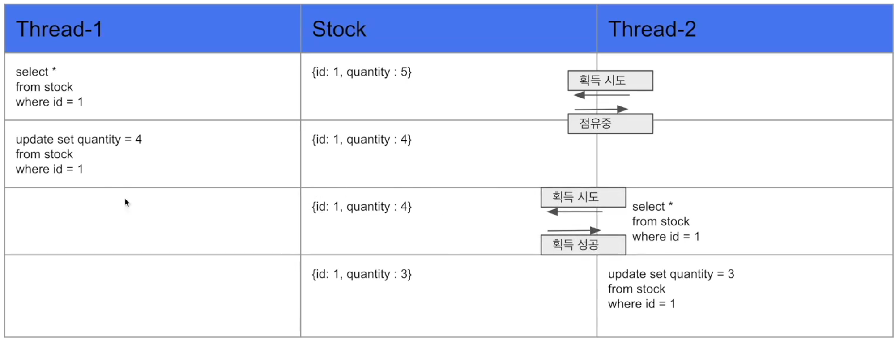

### Optimistic Lock 낙관적 락

- 실제 Lock이 아닌 version을 활용하여 정합성을 맞춤
- 먼저 데이터를 조회 후 update 시 조회한 version이 맞는지 확인하고 업데이트
- version이 달라 실패시 application에서 다시 데이터 조회 후 update 수행
- DB에서 lock을 잡지 않아 성능상 이점이 있음
- 개발자가 직접 재처리 로직을 개발해야함
- race condition이 자주 발생될 것 같은 환경에서는 Pessimistic Lock이 더 효율적

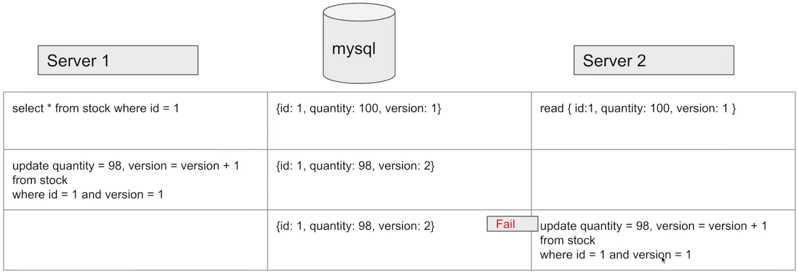

### Named Lock 네임드 락

- 이름을 가진 metadata lock을 통해 정합성을 맞춤
- lock 획득 후 해제할 때까지 다른 세션에서 이 lock을 획득할 수 없음
- transaction이 종료되어도 lock이 자동으로 해제되지 않음
- 별도 명령어를 통한 해제 혹은 선점시간이 끝나야 lock이 해제
- Pessimistic Lock과 유사하지만 lock의 단위가 메타데이터
    - Pessimistic Lock보다 timeout을 구현하기 쉬움
- 주로 분산 lock에 사용
- 실제 사용 시에는 DataSource를 분리해서 사용하는 것이 좋음
    - 동일 DataSource 사용 시 connection pool 부족으로 다른 서비스에도 영향을 끼칠 수 있기 때문

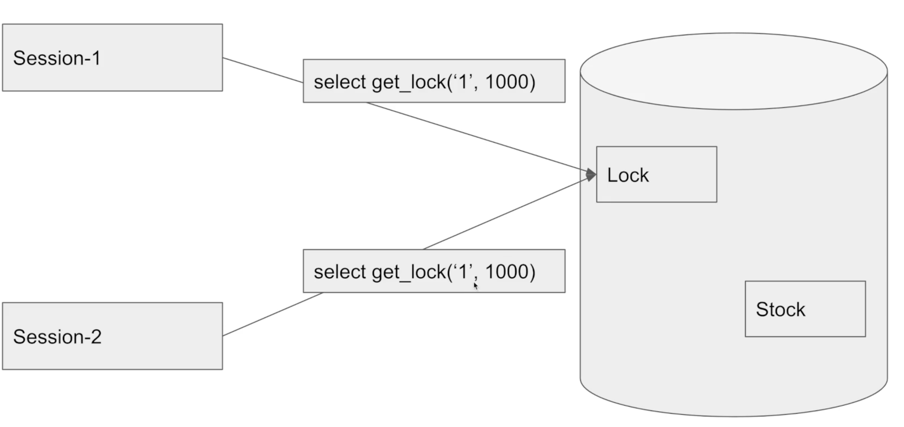

# Redis 활용한 분산 lock 처리

## 라이브러리 종류

### Lettuce

- setnx(set if not exist) 명령어를 활용하여 분산락 구현
- spin lock 방식 : lock을 획득하려는 쓰레드가 lock을 사용할 수 있는지 반복적으로 확인하는 방식
    - redis에 부하를 줄 수 있기 때문에 Thread.sleep을 통해 재시도 간격을 주어야함
- NamedLock과 유사하지만 Redis를 이용하여 세션 관리에 신경을 안써도 된다는 장점이 있음

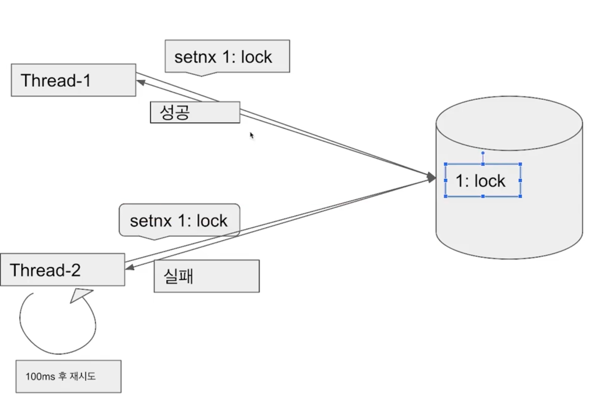

### Redisson

- pub-sub 기반 lock 구현 제공 : 채널을 만들고 lock을 점유 중인 쓰레드가 해제 시 대기 중은 쓰레드에 알림
- 대기 중인 쓰레드는 메시지를 수신 후 lock 점유 시도를 하기 때문에 redis의 부하를 줄여줌

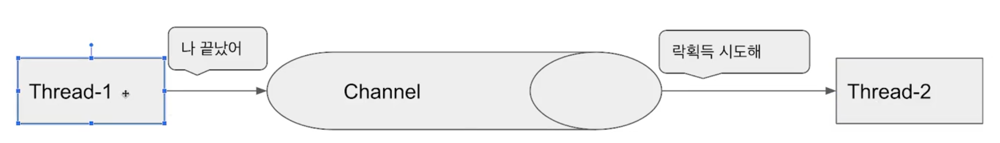

## docker - redis_cli

docker run --name myredis -d -p 6379:6379 redis

docker exec -it ${containerId} redis-cli

### lettuce : setnx

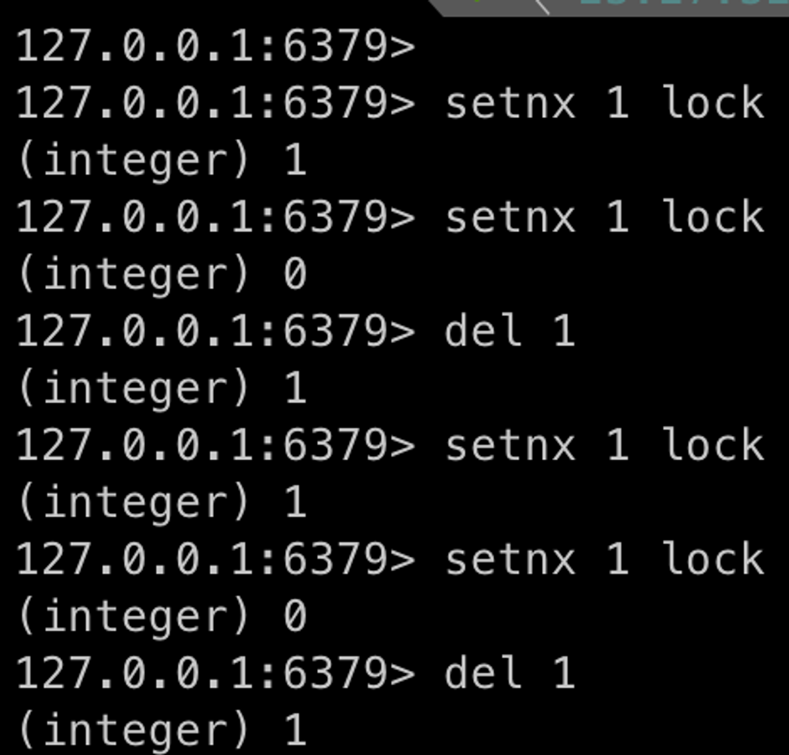

### redisson : pub-sub

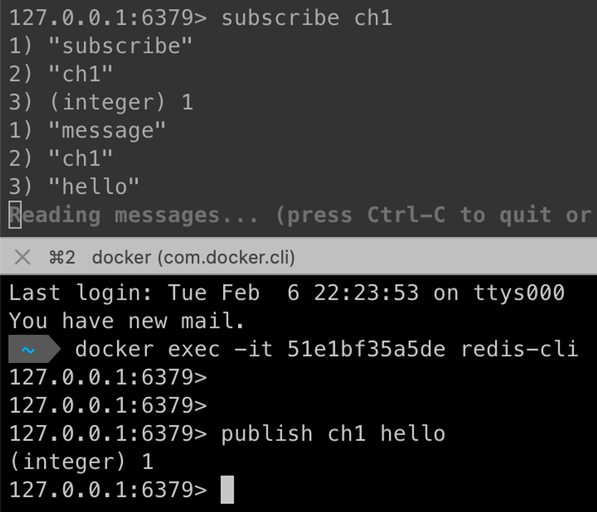

# 결과 비교
- 크게 의미는 없겠지만 그래도 로컬에서 속도 차이가 어느 정도 발생하는지 궁금해서 테스트 진행..!
- 모두 100개의 재고 감소 로직을 수행

## DB Lock

### Pessimistic Lock

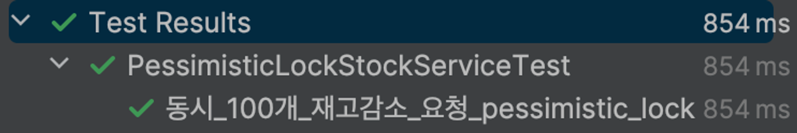

### Optimistic Lock

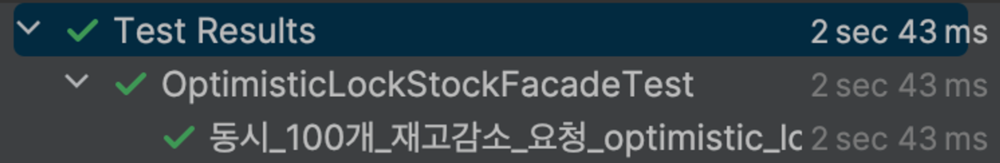

### Named Lock

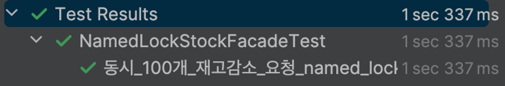

## Redis

### Lettuce

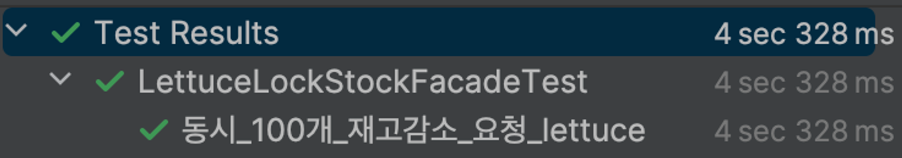

### Reddison

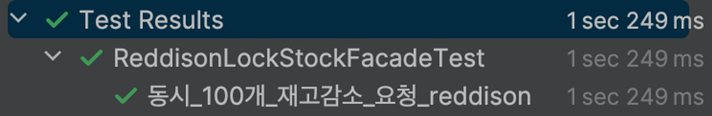